# Potemkin Pipeline

An offline, single-file browser app that simulates the theater of an autonomous
AI coding agent at work — streaming tool calls, second-guessing itself, fixing
bugs it invented moments earlier, shipping to prod, and surviving the occasional
boss-level **drama** (a runaway process on a critical box, a flailing CI pipeline,
a flame graph, a btop meltdown, a volumetric DDoS).

It does not write any code. It performs the *idea* of writing code — the way a
community-theater actor performs the idea of brain surgery. Every counter, graph,
and "172× faster" is a confident lie computed by a seeded PRNG. It's a Potemkin
village for your terminal: real-looking and convincing to a non-technical observer
from across the room, but it will not survive anyone who actually *reads* it (nor
is it trying to).

Use cases, in descending order of honesty: a fun screensaver, a demo of how much
theater modern tooling involves, and an airtight excuse — instead of "it's
compiling," you say *"the agent is busy"* and gesture at the screen.

▶ **[Run it live](https://davidveksler.github.io/potemkin-pipeline/)** · <kbd>f</kbd> force a random drama · <kbd>d</kbd> pick a specific scene · <kbd>b</kbd> boss key · <kbd>?</kbd> all hotkeys

> The agent introduces itself with a fresh, maximally-confident codename each load —
> ORION, COLOSSUS, SINGULARITY, PLUS-ULTRA, STRAWBERRY-Q — drawn from a list of names
> the next frontier model is *definitely* going to be called. It's seed-derived, so a
> shared `?seed=` link summons the same legend twice.

## The show

Every so often the agent hits a "boss" — a production crisis that pops a full-screen
overlay, panics convincingly for a few seconds, then resolves it with the calm of
someone who has never once been on call. Here's the highlight reel:

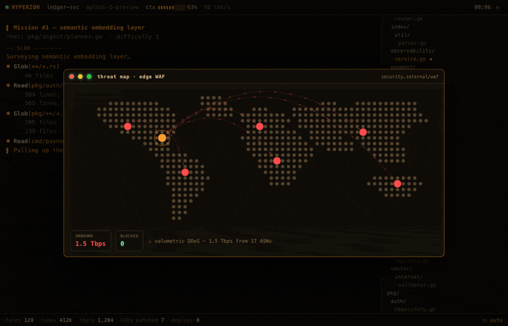

## The full roster

Fourteen distinct dramas, each a tidy crisis → the-agent-acts → recovery arc that
always, always ends in green.

<table>
<tr>
<td width="50%">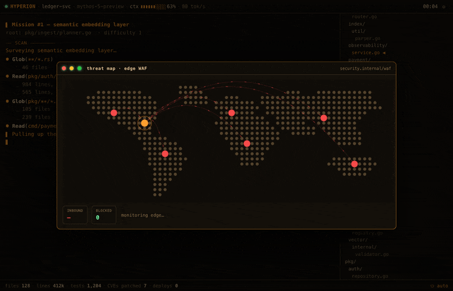<br><sub><b>🌍 Threat map</b> — a volumetric DDoS converges on the edge WAF; the agent null-routes the offending ASNs.</sub></td>
<td width="50%">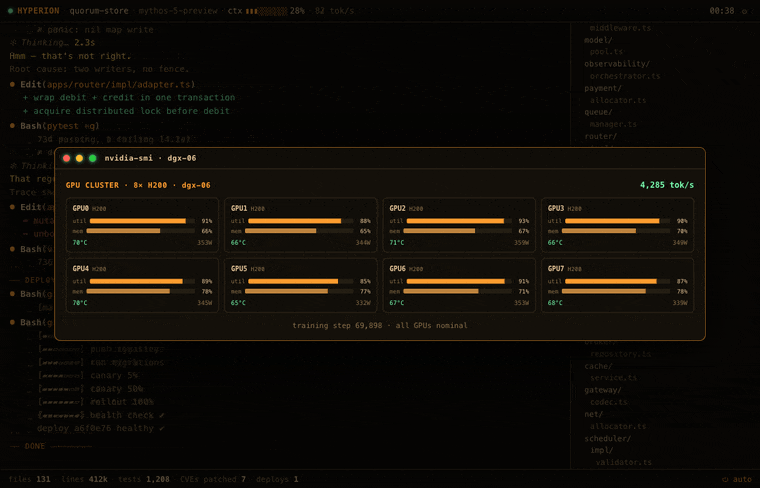<br><sub><b>🎛️ GPU farm</b> — an H200 overheats and throttles; the training shard rebalances across the cluster.</sub></td>
</tr>
<tr>
<td width="50%">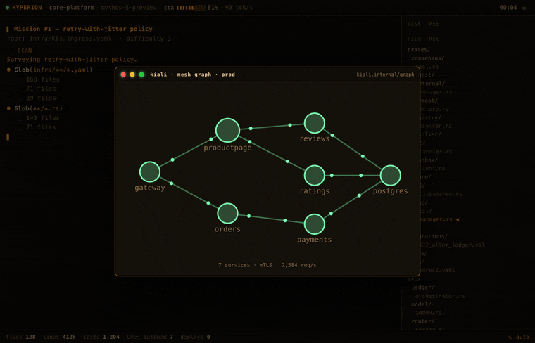<br><sub><b>🛰️ Service mesh</b> — a circuit breaker trips an edge red; bad endpoints are ejected and traffic flows again.</sub></td>
<td width="50%">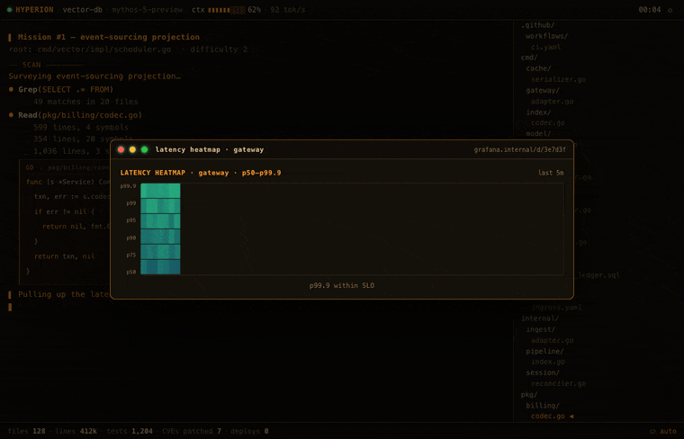<br><sub><b>🔥 Latency heatmap</b> — the p99.9 tail blows out while p50 stays flat, then cools after a hedging fix.</sub></td>
</tr>
<tr>
<td width="50%">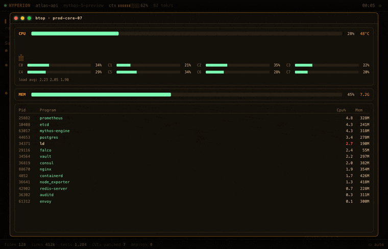<br><sub><b>📊 btop meltdown</b> — a runaway process pins several cores; resolved via <code>kill -9</code> and pure confidence.</sub></td>
<td width="50%">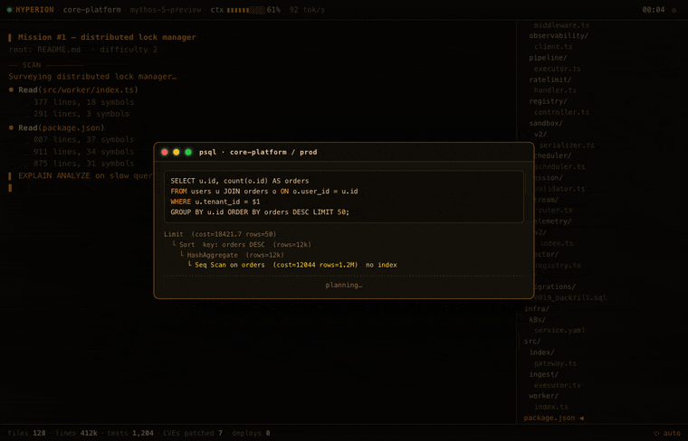<br><sub><b>🗄️ Slow query</b> — <code>EXPLAIN ANALYZE</code> reveals a seq scan; a concurrent index makes it 172× faster.</sub></td>
</tr>
<tr>
<td width="50%">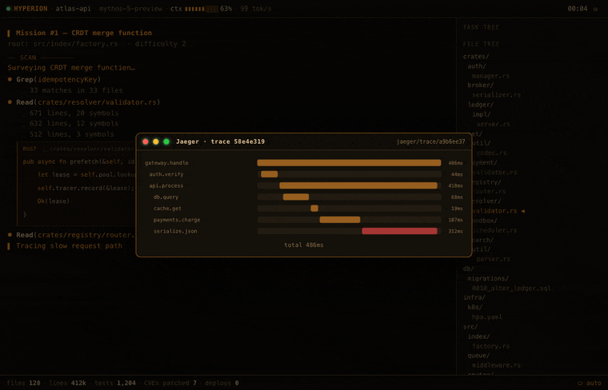<br><sub><b>🔍 Distributed trace</b> — a Jaeger trace pins a slow serialize span; streaming the encoder cuts tail latency.</sub></td>
<td width="50%">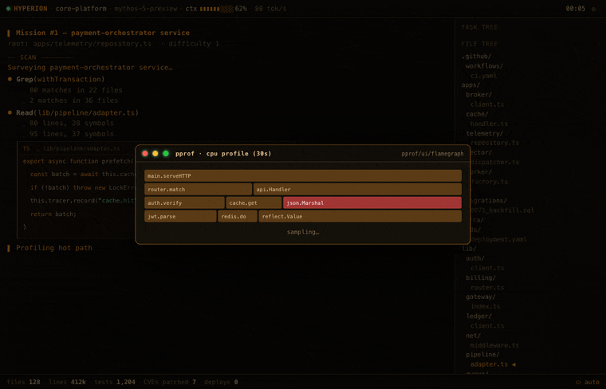<br><sub><b>🔥 Flame graph</b> — pprof shows a hot <code>json.Marshal</code> path; a <code>sync.Pool</code> rewrite lands ~4× faster.</sub></td>
</tr>
<tr>
<td width="50%">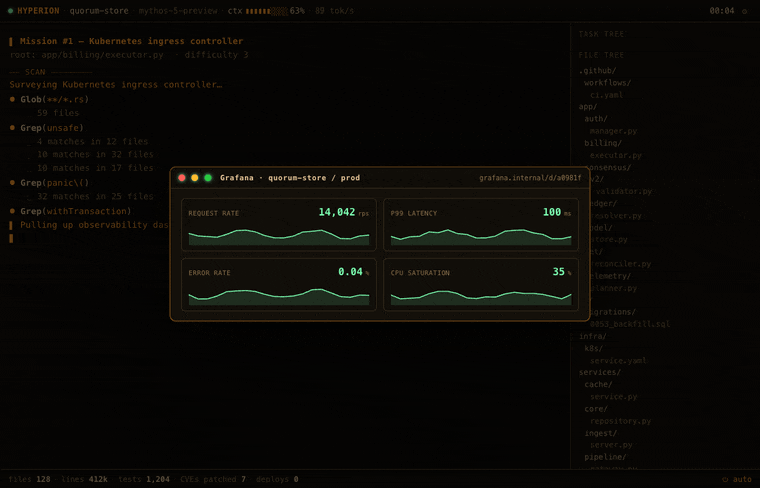<br><sub><b>📈 Grafana SLO</b> — the error rate breaches the SLO; scaling the deployment pulls it back into the green.</sub></td>
<td width="50%">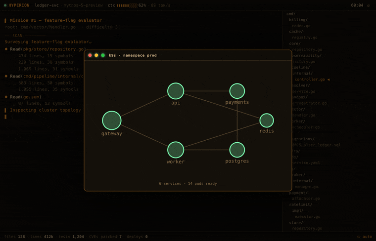<br><sub><b>☸️ Cluster</b> — a pod hits <code>CrashLoopBackOff</code>; a rollout restart reschedules it healthy.</sub></td>
</tr>
<tr>
<td width="50%">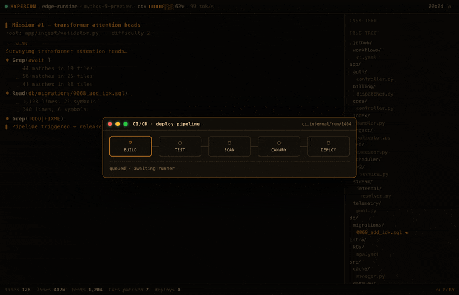<br><sub><b>🔧 CI/CD pipeline</b> — build → test → scan → canary → deploy marches green and ships to prod.</sub></td>
<td width="50%">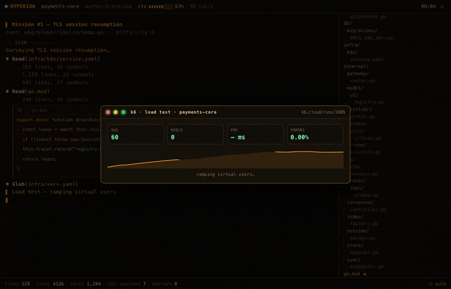<br><sub><b>🚦 Load test</b> — k6 ramps virtual users to a sustained peak rps at a healthy p95 with zero errors.</sub></td>
</tr>
<tr>
<td width="50%">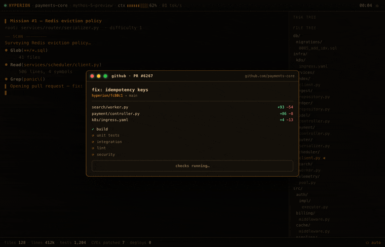<br><sub><b>🔀 Pull request</b> — every check goes green and the PR merges into <code>main</code> with zero review comments.</sub></td>
<td width="50%">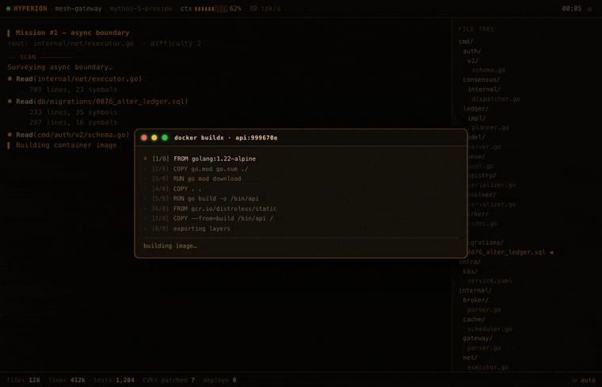<br><sub><b>🐳 Docker build</b> — a multi-stage <code>buildx</code> runs layer by layer and pushes to the registry.</sub></td>
</tr>
</table>

> GIFs are short loops captured at default (medium) intensity. They re-render slightly
> differently every run — every story beat is driven by a seeded RNG.

## Under the hood

For a project about fake software, the engine is real and small (~105 KB of JS, no
framework). The interesting parts:

- **One render loop, one clock.** A single `requestAnimationFrame` drives a *logical*
  clock — nothing uses `setInterval` or wall time. Tab away and it pauses instead of
  replaying four thousand catch-up frames the instant you come back.
- **The script is a generator.** Every mission and boss drama is a JS generator
  (`function*`) that *yields* typed events — `TOOL('Bash', …)`, `DIFF('+', …)`,
  `THINK()`, `WAIT(900)`, `OV('app', …)`. A scheduler pumps each event when the clock
  passes its due time. ~14 event constructors compose **20 scripted dramas** (6 ambient
  + 14 boss) on top of a never-ending stream of fake missions.
- **Determinism by seed.** A 32-bit `mulberry32` PRNG seeds everything narratively
  load-bearing: the procedurally generated file tree, the project, the agent's codename,
  which crisis strikes and how bad it gets. `?seed=N` reproduces a run to the beat.
  Cosmetic per-frame jitter deliberately uses `Math.random()` instead — you want the
  graphs to shimmer, not to be byte-for-byte reproducible.
- **Overlays are tiny fake apps.** Each boss scene registers a builder in an
  `APP_BUILDERS` map (tool → builder) that constructs a faux window — nvidia-smi, btop,
  Jaeger, a Kiali-ish mesh, a threat map. The script then mutates it live through
  `[data-k]` hooks (no re-render): flip a GPU to `THROTTLE`, turn a pod red, blow out the
  tail. Continents on the threat map are a hand-rolled dot bitmap; mesh packets ride SMIL
  `animateMotion`; the heatmap and btop graphs are `<canvas>`.
- **Theming & a11y.** Three palettes (amber / green / cyan) via CSS custom properties.
  All motion sits behind `body:not(.reduce)` and honors `prefers-reduced-motion`, so the
  office screensaver doesn't induce a seizure.
- **Sound from nothing.** Optional WebAudio blips and beeps, synthesized on the fly. No
  audio files — audio files are dependencies, and we don't do those here.
- **One file, zero requests.** `build.sh` is a tiny `awk` script that inlines the CSS and
  JS into `index.html` — the only "bundler" a no-dependency project is allowed. The result
  opens over `file://` on a plane: no server, no fonts, no trackers, no `node_modules`
  bending spacetime in your repo.

## Knobs

**Hotkeys** (also in the in-app <kbd>?</kbd> drawer):

| key | does |
|-----|------|
| <kbd>m</kbd> | toggle autopilot ↔ performer mode |
| <kbd>space</kbd> | pause / resume |
| <kbd>1</kbd> <kbd>2</kbd> <kbd>3</kbd> | theme: amber / green / cyan |
| <kbd>+</kbd> <kbd>−</kbd> | speed up / down |
| <kbd>f</kbd> | force a random drama |
| <kbd>d</kbd> | open the scene picker and fire any drama on demand |
| <kbd>b</kbd> | **boss key** — instant innocent "Connecting to corporate VPN…" screen |
| <kbd>s</kbd> | configuration dialog (also writes a shareable URL) |

In **performer mode**, the show stops running itself and you mash any key to stream
the next tokens under your own fingertips — for when someone's watching and you need
to look 100× productive on demand. The **boss key** is the emergency eject: one tap
and the screen becomes a perfectly boring VPN spinner.

Leave the keyboard alone for a while and it slips into **deep-work "away" mode**: the
agent clears the log and settles into a single, unbroken, multi-minute grind toward a
suitably heroic goal — *"Backfilling the ledger from genesis · 14% · 2,278,901 /
15,736,440 rows"* — counters ticking up the whole time. Walk away from the desk and
the machine looks like it's earning its keep; touch any key (or the mouse) and it
parks the pass and snaps back to the regular show. Tune the delay (or switch it off)
with `?idle=N` or the config dialog; defaults to 30s.

**URL params** (all optional, all persist via the config dialog's *Copy link*):
`?seed=N` · `?agent=NAME` · `?project=NAME` · `?theme=amber|green|cyan` ·
`?speed=0.25–4` · `?intensity=off|low|med|max` · `?mode=performer` · `?idle=N`
(seconds before deep-work mode; `0` disables) · `?audio=on` · `?crt=on` ·
`?debug` (exposes a `window.__HYP` test hook — `__HYP.drama('gpu')`, `__HYP.deepwork()`, `__HYP.state()`).

## Layout

Developed as split files and re-inlined into a standalone distributable:

- `hyperion.html` — markup
- `hyperion.css` — styles (themes, overlays, the boss-window chrome)
- `hyperion.js` — the engine (RNG, mission/drama generators, scheduler, overlay + app builders, live tickers, WebAudio)
- `build.sh` — inlines CSS + JS into `index.html`
- `index.html` — the generated single-file artifact you deploy (also the GitHub Pages root)
- `assets/` — README GIFs only; not shipped in the app

> In-app the simulated product is branded with a random codename (HYPERION is one of
> them); *Potemkin Pipeline* is the project name. Source files keep the `hyperion.*`
> prefix for historical reasons / sentimental value.

## Build

```sh
./build.sh   # → index.html  (~140 KB, zero external requests)
```

There is no test suite, because there is nothing to test, because none of it is real.
(There is a `?debug` hook, used to capture the GIFs above via headless Chrome.)

## Live

- GitHub Pages: https://davidveksler.github.io/potemkin-pipeline/
- Target home: cheatsheets.davidveksler.com
